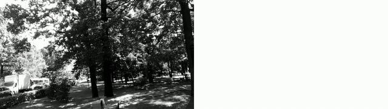

# neurosim_cu_esim

High-performance CUDA implementations of event camera simulation algorithms written for the [Neurosim simulator](https://github.com/grasp-lyrl/neurosim).
Algorithms are implemented as fused CUDA kernels with warp-level aggregation.

✨ EventSimulator mode achieves **~11× better throughput** and **~10× lower latency** than [rpg_vid2e](https://github.com/uzh-rpg/rpg_vid2e) esim CUDA implementation. Check [Quickstart](#quick-start)

🚀 VoltmeterSimulator mode achieves **~250×–675× faster** than [Lin et al., *DVS-Voltmeter*, ECCV 2022](https://github.com/Lynn0306/DVS-Voltmeter) (~21,000 calls/s vs. 31 calls/s CPU / 84 calls/s GPU). Check [DVS-Voltmeter](#dvs-voltmeter-stochastic-model)

🚀 GracaDVSSimulator mode implements the physically-realistic model from [Graca & Delbruck, *Towards a physically realistic computationally efficient DVS pixel model*, 2025](https://arxiv.org/abs/2505.07386). Check [Graca DVS Model](#graca-dvs-model)


<p align="center">
    
    <br/>
    <em>Example output: input frame (left) with events aggregated for 20 ms (right). See <a href="#benchmarking">Benchmarking</a> for reproduction.</em>
</p>

<p align="center">
    
    <br/>
    <em>Example event simulation using DVSVoltmeterSimulator on a real video</em>
</p>

**Forward latency at 640×480 on an RTX 4090:** `single` ~21 µs · `multi` ~22 µs · `voltmeter` ~25 µs — all **much faster** than the corresponding reference implementations. See [Benchmarking](#benchmarking) for details.

## Contents

- [neurosim\_cu\_esim](#neurosim_cu_esim)
  - [Contents](#contents)
  - [How it works (Single event mode)](#how-it-works-single-event-mode)
  - [Requirements](#requirements)
  - [Installation](#installation)
  - [Quick start](#quick-start)
    - [Multi-event mode](#multi-event-mode)
  - [DVS-Voltmeter (stochastic model)](#dvs-voltmeter-stochastic-model)
  - [Graca DVS Model (physically-realistic)](#graca-dvs-model)
  - [API reference](#api-reference)
    - [`EventSimulator(width, height, ...)`](#eventsimulatorwidth-height-)
    - [`EventSimulator.forward(image, timestamp_us) -> Events | None`](#eventsimulatorforwardimage-timestamp_us---events--none)
    - [`EventSimulator.init(first_image)` / `EventSimulator.reset(first_image=None)`](#eventsimulatorinitfirst_image--eventsimulatorresetfirst_imagenone)
    - [Runtime threshold](#runtime-threshold)
    - [Diagnostics](#diagnostics)
  - [Benchmarking](#benchmarking)
    - [**Sanity animation** (frame + aggregated events MP4):](#sanity-animation-frame--aggregated-events-mp4)
    - [**Run on a real video**](#run-on-a-real-video)
  - [Running tests](#running-tests)
  - [Linting](#linting)
  - [Citation](#citation)
  - [Issues](#issues)
  - [License](#license)

## How it works (Single event mode)

| Step | Description |
|------|-------------|
| 1 | Maintain per-pixel upper/lower bounds in **log-intensity** space. |
| 2 | For each new frame, compute `log(pixel)` and compare against bounds. |
| 3 | If the log-intensity exceeds the upper bound → **positive event** (polarity 1). |
| 4 | If it drops below the lower bound → **negative event** (polarity 0). |
| 5 | On event: reset bounds around current value. No event: tighten bounds. |

All five steps execute in a single kernel launch.

## Requirements

| Dependency | Minimum version |
|------------|-----------------|
| Python | 3.9 |
| PyTorch | 2.0 |
| CUDA toolkit | 11.8 |

## Installation

The CUDA kernel is compiled from source at install time against your installed PyTorch. Make sure `nvcc` is on your `PATH` and compatible with the CUDA version your PyTorch was built against:

```bash
python -c "import torch; print(torch.version.cuda)"  # torch's CUDA
nvcc --version                                       # toolkit CUDA
```

Then install:

```bash
git clone https://github.com/grasp-lyrl/neurosim_cu_esim.git
cd neurosim_cu_esim
pip install .

# Editable install with dev dependencies (pytest, ruff)
pip install -e ".[dev]"
```

## Quick start

> **Input format.** All simulators take **linear-intensity** frames, positive values. `EventSimulator` is scale-invariant — any positive range works (`[0, 1]`, `[0, 255]`, ...); the kernel applies `log()` internally. `DVSVoltmeterSimulator` expects **0–255** natively (its `k` params are calibrated to that scale), or pass `input_normalized=True` to feed it `[0, 1]` directly.

```python
import torch
from neurosim_cu_esim import EventSimulator

# Create the simulator
sim = EventSimulator(
    width=640,
    height=480,
    contrast_threshold_neg=0.3,   # log-intensity units
    contrast_threshold_pos=0.3,
    device="cuda",
)

# Feed the first frame (initialises internal state, returns None)
first_frame = torch.rand(480, 640, device="cuda").clamp(min=1e-4)
sim.init(first_frame)

# Process subsequent frames
for i in range(1, 100):
    frame = torch.rand(480, 640, device="cuda").clamp(min=1e-4)
    events = sim(frame, timestamp_us=i * 1000)

    if events is not None:
        print(f"Frame {i}: {events.x.numel()} events")
        # events.x  — column coords  (uint16, CUDA)
        # events.y  — row coords     (uint16, CUDA)
        # events.t  — timestamps µs  (uint64, CUDA)
        # events.p  — polarity 0/1   (uint8,  CUDA)
```

**For a complete example with a moving texture stimulus, see:** [Benchmark with animation](#benchmarking).

### Multi-event mode

By default the simulator emits **at most one event per pixel per frame**
(`mode="single"`), which is the right choice for high-fps inputs where each frame step spans at most one contrast threshold.

Set `mode="multi"` to emit **as many events as the
log-contrast change warrants**, with their timestamps spread *equally* across
the interval between the previous and current frame (the last event lands
exactly on the current `timestamp_us`):

```python
sim = EventSimulator(
    width=640, height=480,
    mode="multi",
    max_events=640 * 480 * 32,   # a frame step can emit many events/pixel
)
```

In `"multi"` mode size `max_events` for the expected per-frame burst; events
beyond the cap are dropped (with a warning).

## DVS-Voltmeter (stochastic model)

A separate, **stochastic** event simulator based on [Lin et al., *DVS-Voltmeter*, ECCV 2022](https://github.com/Lynn0306/DVS-Voltmeter). Each pixel's sensor voltage is modelled as **Brownian motion with drift** (paper Eq. 10/11), and events are sampled at threshold crossings — so timestamps carry realistic shot-noise jitter, and a calibrated **leakage current** produces background ON events.

Input is **linear intensity** (0–255 — the scale the `k` params are calibrated to), not log:

```python
from neurosim_cu_esim import DVSVoltmeterSimulator

sim = DVSVoltmeterSimulator(
    width=640, height=480,
    camera_type="DVS346",     # or "DVS240"; or pass k=[k1..k6] explicitly
    randomize_phase=True,     # random per-pixel leakage phase
                              # (avoids synchronised background flashes)
    leak_scale=1.0,           # 1.0=faithful; lower to suppress bg ON events
    seed=0, device="cuda",
)
events = sim(frame_0_255_float.cuda(), timestamp_us)
```

## Graca DVS Model (physically-realistic)

A continuous-time physically realistic event simulator based on [Graca & Delbruck, *Towards a physically realistic computationally efficient DVS pixel model*, 2025](https://arxiv.org/abs/2505.07386). 
This model uses a dynamic linear parameter-varying (LPV) state-space to accurately capture the low-pass behavior of the photoreceptor, asymmetric temporal bandwidths, and voltage noise, resolving artifacts seen in log-contrast models at high frequencies.

Input is **photocurrent in Amperes** (typically `1e-15` to `1e-12`), not 0-255 or log-intensity. For example, if you have a `[0, 1]` or `[0, 255]` image, you should scale it to the physical photocurrent range:

```python
from neurosim_cu_esim import GracaDVSSimulator

sim = GracaDVSSimulator(
    width=640, height=480,
    full_well_saturation_threshold=1e-12,
    dark_current=1e-15,
    device="cuda",
)
# Example: scale a [0, 255] frame to [0, 1e-12] Amperes
photocurrent = (frame_0_255_float.cuda() / 255.0) * 1e-12
events = sim(photocurrent, timestamp_us)
```

## API reference

### `EventSimulator(width, height, ...)`

| Parameter | Type | Default | Description |
|-----------|------|---------|-------------|
| `width` | `int` | — | Sensor width in pixels |
| `height` | `int` | — | Sensor height in pixels |
| `contrast_threshold_neg` | `float` | `0.35` | Negative contrast threshold (log scale) |
| `contrast_threshold_pos` | `float` | `0.35` | Positive contrast threshold (log scale) |
| `max_events` | `int \| None` | `W × H` | Cap on events per frame |
| `mode` | `str` | `"single"` | `"single"` = ≤1 event/pixel/frame; `"multi"` = many events/pixel with timestamps spread across the inter-frame interval |
| `device` | `str` | `"cuda"` | CUDA device |

### `EventSimulator.forward(image, timestamp_us) -> Events | None`

| Parameter | Type | Description |
|-----------|------|-------------|
| `image` | `torch.Tensor` | Grayscale `(H, W)` frame, positive values |
| `timestamp_us` | `int` | Frame timestamp in microseconds |

Returns a named tuple `Events(x, y, t, p)` or `None` if zero events.

### `EventSimulator.init(first_image)` / `EventSimulator.reset(first_image=None)`

Initialize or reset internal state.

### Runtime threshold

```python
sim.set_contrast_thresholds(neg=0.2, pos=0.5)
```

### Diagnostics

```python
print(sim.state)                  # internal intensity bounds
print(sim.buffer_memory_bytes)    # GPU memory used by output buffers
```

## Benchmarking

```bash
python3 scripts/benchmark_esim.py                                     # ESIM single (default)
python3 scripts/benchmark_esim.py --mode multi                        # ESIM multi
python3 scripts/benchmark_esim.py --mode voltmeter --randomize-phase  # DVS-Voltmeter
python3 scripts/benchmark_esim.py --mode graca                        # Graca model
```

**Reported metrics:** calls/sec (kHz), events/sec (Mev/s), events/call, mean forward latency (CUDA event timing), mean/peak GPU utilisation (`nvidia-smi` polling). Saved to `benchmarks/esim_benchmark_results.json`.

**Throughput on an RTX 4090** (640×480, 1000 fps timestamps, fp32, 3 trials × 1 M forwards):

| mode | calls/s | latency | events/call | events/sec |
|------|--------:|--------:|------------:|-----------:|
| `single` — ESIM, ≤1 event/pixel/frame (default) | 47.5 kHz | 21 µs | 18 017 | 856 Mev/s |
| `multi` — ESIM, many events/pixel (low-fps) | 46.2 kHz | 22 µs | 21 668 | 1 002 Mev/s |
| `voltmeter` — DVS-Voltmeter stochastic | 39.3 kHz | 25 µs | 18 024 | 709 Mev/s |
| `graca` — Graca physically-realistic | *TBD* | *TBD* | *TBD* | *TBD* |

**Throughput on an RTX 4070 Laptop** (640×480, 1000 fps timestamps, fp32, 3 trials × 200 k forwards):

| mode | calls/s | latency | events/call | events/sec |
|------|--------:|--------:|------------:|-----------:|
| `single` — ESIM, ≤1 event/pixel/frame (default) | 37.0 kHz | 27 µs | 18 017 | 667 Mev/s |
| `multi` — ESIM, many events/pixel (low-fps) | 33.7 kHz | 30 µs | 21 669 | 729 Mev/s |
| `voltmeter` — DVS-Voltmeter stochastic | 21.1 kHz | 47 µs | 18 186 | 383 Mev/s |
| `graca` — Graca physically-realistic | *TBD* | *TBD* | *TBD* | *TBD* |

Voltmeter is ~1.2–1.7× the latency of ESIM (per-pixel RNG + IG/Lévy sampling) but still tens of kHz at VGA — far above the reference PyTorch implementation (~84 Hz GPU-patched, ~31 Hz CPU).

### **Sanity animation** (frame + aggregated events MP4):

Save the video of event simulation on the moving texture stimulus.

```bash
python3 scripts/benchmark_esim.py --sanity-video sanity.mp4 \
    --mode voltmeter --randomize-phase
```

### **Run on a real video**

Run any mode; side-by-side frame | events MP4, on a real video.

```bash
python3 scripts/simulate_on_video.py --input in.mp4 --output out.mp4 \
    --mode voltmeter --randomize-phase
```

## Running tests

```bash
pip install -e ".[dev]"
conda run -n esim pytest
```

## Linting

```bash
ruff check .
ruff format --check .
```

## Citation

If you use this code in your research, please cite:

```bibtex
@misc{das2026neurosim,
      title={Neurosim: A Fast Simulator for Neuromorphic Robot Perception}, 
      author={Richeek Das and Pratik Chaudhari},
      year={2026},
      eprint={2602.15018},
      archivePrefix={arXiv},
      primaryClass={cs.RO},
      url={https://arxiv.org/abs/2602.15018}, 
}
```

and checkout [Neurosim](https://github.com/grasp-lyrl/neurosim) for the full simulator codebase.

## Issues

Please report any bugs or feature requests on GitHub issues. Pull requests are also welcome!

## License

Apache-2.0. See [LICENSE](LICENSE) for details.
